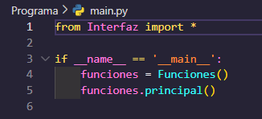

# MANUAL TÉCNICO

## Descripción de la practica
*Texto en cursiva*

### ¿Qué paradigma se utilizó?
*Texto en cursiva*

## Lógica del programa
*Esta herramienta  permitira el diseño y creación de sentencias de bases de datos no relacionales de una forma sencilla. La aplicación tendrá un área de edición de código y un área de visualización de la sentencia final generada.
Cuando ya se cuente con las sentencias creadas inicialmente, se procederá a realizar la compilación respectiva lo que generar las sentencias de MongoDB que serán mostradas en el espacio de resultados*

---

#### MAIN
*Estas líneas definen un bloque de ejecución condicional en Python que permite verificar si el archivo actual se está ejecutando como programa principal o si ha sido importado como modulo por otro archivo.*

#### CLASE ANALIZADOR
*texto*
- Lista sin orden
- Lista sin orden
- Lista sin orden

#### CLASE ERRORES
*texto*
- Lista sin orden
- Lista sin orden
- Lista sin orden

#### CLASE INTERFAZ
*texto*
- Lista sin orden
- Lista sin orden
- Lista sin orden

#### CLASE TOKN
*texto*
- Lista sin orden
- Lista sin orden
- Lista sin orden

#### TABLA DE TOKENS
*texto*
- Lista sin orden
- Lista sin orden
- Lista sin orden

#### MÉTODO DEL ÁRBOL
*texto*
- Lista sin orden
- Lista sin orden
- Lista sin orden

#### GRÁGICO DE AUTÓMATA FINITO DETERMINISTA
*texto* 
- Lista sin orden
- Lista sin orden
- Lista sin orden

#### GRAMÁTICA DE LIBRE CONTEXTO
*texto*
- Lista sin orden
- Lista sin orden
- Lista sin orden

---

