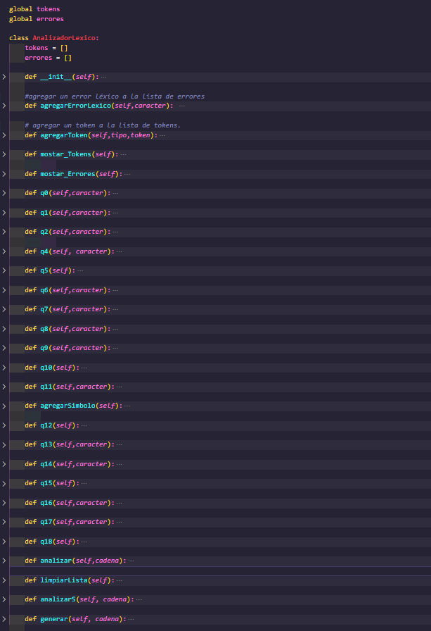
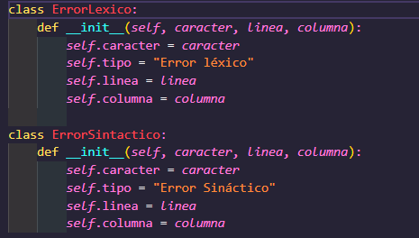
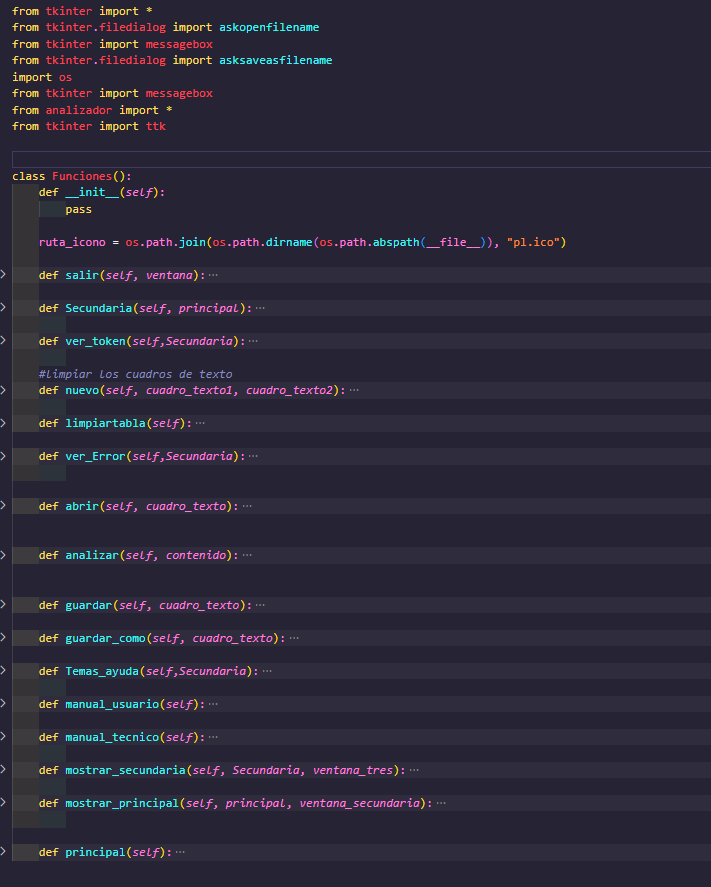
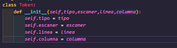
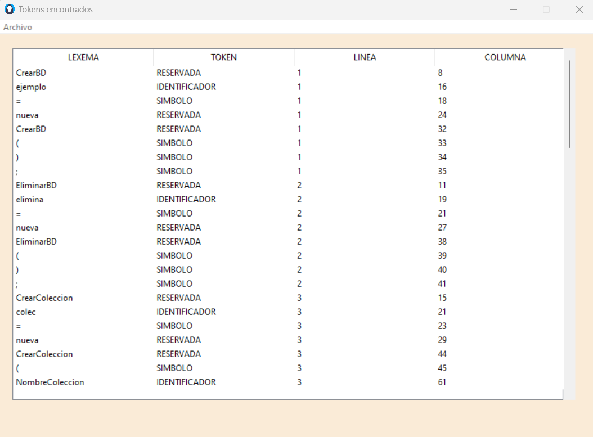
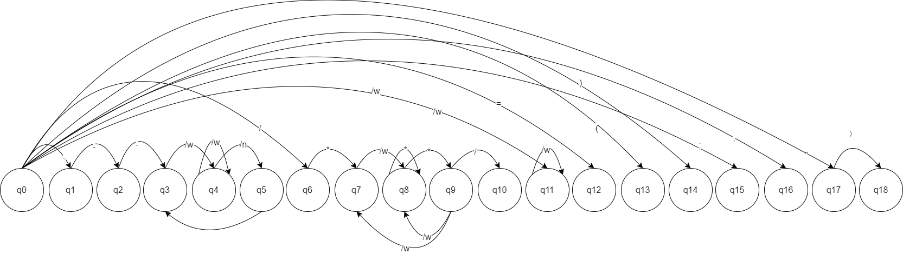

# MANUAL TÉCNICO

## Descripción de la practica
*Este programa fue desarrollado con el lenguaje de programación Python, el objetivo principal de
este programa fue crear una herramienta la cual sea capaz de reconocer un lenguaje, dado por
medio de un analizador léxico y sintactico el cual cumple con las reglas establecidas, manejando la lectura
y escritura de archivos para el manejo de la información. A través de un entorno gráfico.*

### ¿Qué paradigma se utilizó?
*Se utilizo el paradigma imperativo o de procedimientos , este es un método que nos permite
desatollar programas a través de procedimientos y además se utilizó POO (Programación Orientada
a Objetos), este es un modelo o estilo de programación que proporciona unas guías acerca de cómo
trabajar con él y que este está basado en el concepto de clases y objetos.*

## Lógica del programa
*Esta herramienta  permitira el diseño y creación de sentencias de bases de datos no relacionales de una forma sencilla. La aplicación tendrá un área de edición de código y un área de visualización de la sentencia final generada.
Cuando ya se cuente con las sentencias creadas inicialmente, se procederá a realizar la compilación respectiva lo que generar las sentencias de MongoDB que serán mostradas en el espacio de resultados*

---

### MAIN
*Estas líneas definen un bloque de ejecución condicional en Python que permite verificar si el archivo actual se está ejecutando como programa principal o si ha sido importado como modulo por otro archivo.*

---
### CLASE ANALIZADOR
*El código define una clase AnalizadorLexicoque tiene varios métodos que corresponden a diferentes estados en el autómata finito que se usa para analizar la entrada. El q0método es el estado inicial, que pasa a otros estados según el carácter de entrada actual.*

*El código toma una cadena de caracteres y la analiza para identificar tokens válidos según una gramática determinada. Los tokens válidos se agregan a una lista de tokens y los tokens no válidos se agregan a una lista de errores.*

---

### CLASE ERRORES
- ErrorLexico representa un error léxico, que es un error que ocurre cuando el analizador encuentra un token que no es válido según las reglas gramaticales del idioma.
- ErrorSintactico, por otro lado, representa un error de sintaxis, que es un error que ocurre cuando el analizador encuentra una construcción que no es válida según las reglas gramaticales del lenguaje.

---
### CLASE INTERFAZ
*El módulo interfaz contiene una clase funciones que establece como crear la interfaz grafica y todos sus componentes.*

- salir (): se encarga de cerrar una ventana en una interfaz gráfica de usuario.
- Secundaria (): crea una ventana secundaria y la muestra en la pantalla. La ventana secundaria incluye un cuadro de texto y un menú que permite abrir, guardar y analizar un archivo de texto, entre otras opciones.
- Abrir(): Este método permite abrir un archivo seleccionado por el usuario y mostrar su contenido en un cuadro de texto.
- Analizar(): Recibe un string contenido que representa el código fuente a analizar.
- Escribir_error(): toma los errores almacenados en la lista global lista_errores y los escribe en un archivo JSON en la ruta
- Guardar(): El contenido de un cuadro de texto en un archivo. Primero verifica si hay una ruta de archivo almacenada, en cuyo caso utiliza esa ruta para guardar el archivo. Si no hay una ruta de archivo almacenada
- Guardar_como(): solicita al usuario que seleccione una nueva ubicación y nombre de archivo para guardar el archivo.
- Temas_ayuda(): Crea una nueva ventana para mostrar información y un botón para volver a la ventana anterior. La información que se muestra incluye los datos del estudiante que realizo la aplicación.
- Manual_usuario(): abre un archivo PDF del manual de usuario del programa.

---

### CLASE TOKN
*Token es una representación de un token generado por un escáner  en un analizador léxico de un lenguaje de programación.*

- tipo: el tipo de token (por ejemplo, identificador, número, operador, etc.).
escaner: el valor del token (por ejemplo, si el tipo es un - identificador, el escaner sería el nombre del identificador).
- linea: la línea del archivo fuente donde se encontró el token.
- columna: la columna del archivo fuente donde se encontró el token.

---

### TABLA DE TOKENS

*Se listan todos los tokens que se reconocieron en el archivo de entrada*

---

### MÉTODO DEL ÁRBOL

*AFD*

*EL método del Árbol es una técnica que se utiliza para crear lo que es un DEA (Autómata Finito Determinista) mínimo. El DFA es un autómata finito que no posee transiciones con nulos y no existen dos o más transiciones con el mismo símbolo al mismo estado.*

---

#### GRÁGICO DE AUTÓMATA FINITO DETERMINISTA

- q0: Estado inicial. Lee el siguiente caracter y decide a qué estado moverse.
- q1: Lee un guión '-' y espera otro guión para formar el token de comentario multilinea. Si no hay otro guión, produce un error.
- q2: Lee dos guiones '--' y espera otro guión para formar el token de comentario de una sola línea. Si no hay otro guión, produce un error.
- q3: Estado de aceptación de los tokens de comentarios. Espera a que se termine el comentario para volver al estado inicial.
- q4: Lee el primer '*' después de un '/', indicando el inicio de un comentario multilinea. Lee el siguiente caracter y decide a qué estado moverse.
- q5: Estado de aceptación de los tokens de comentarios de una sola línea. Espera a que se termine la línea para volver al estado inicial.
- q6: Lee una barra '/' y espera un asterisco '*' para indicar el inicio de un comentario multilinea. Si no hay asterisco, produce un error.
- q7: Lee caracteres dentro de un comentario multilinea y espera otro asterisco '*' para indicar que puede estar por terminar. Si no hay asterisco, sigue leyendo más caracteres.
- q8: Lee caracteres dentro de un comentario multilinea y espera otro asterisco '*' para indicar que puede estar por terminar. Si no hay asterisco, sigue leyendo más caracteres.
- q9: Estado de aceptación de los tokens de comentarios multilinea. Espera a que se termine el comentario para volver al estado inicial.
- q10: Lee un dígito y decide a qué estado moverse, según si se trata de un número entero o decimal.
- q11: Lee una letra o un símbolo '$' y decide a qué estado moverse, según si se trata de un identificador o una palabra reservada.
- q12: Estado de aceptación del token de igualdad '='. Vuelve al estado inicial.
- q13: Estado de aceptación del token de paréntesis izquierdo '('. Vuelve al estado inicial.
- q14: Estado de aceptación del token de paréntesis derecho ')'. Vuelve al estado inicial.
- q15: Estado de aceptación del token de punto y coma ';'. Vuelve al estado inicial.
- q16: Estado de aceptación del token de coma ','. Vuelve al estado inicial.
- q17: Lee una comilla '"' y espera otra comilla para indicar que se ha encontrado un literal de cadena. Si no hay otra comilla, produce un error.
- q18: Estado de aceptación de los tokens de literales de cadena. Espera a que se termine el literal para volver al estado inicial.

---

### GRAMÁTICA DE LIBRE CONTEXTO
*la gramática permite generar cualquier cadena válida de entrada para el analizador léxico y también permite derivar cualquier posible cadena de salida.*

---

