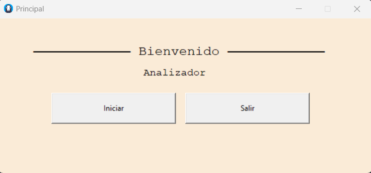
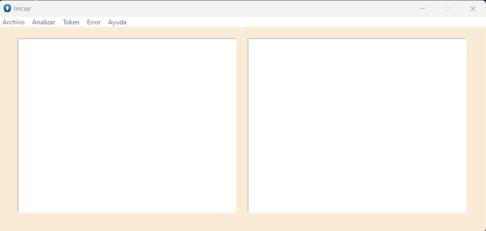
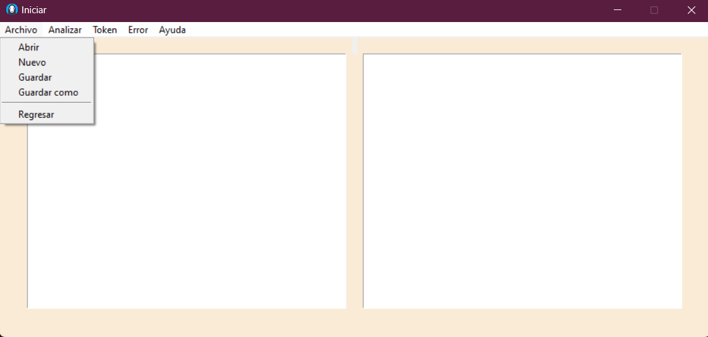
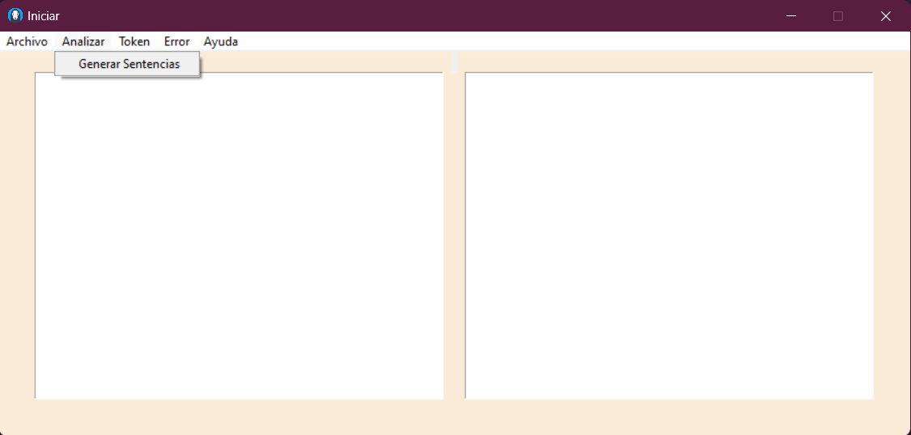
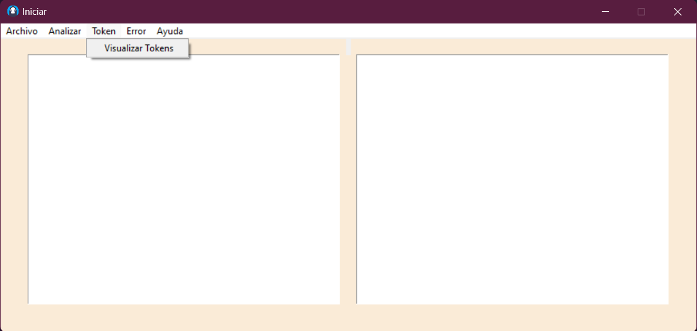
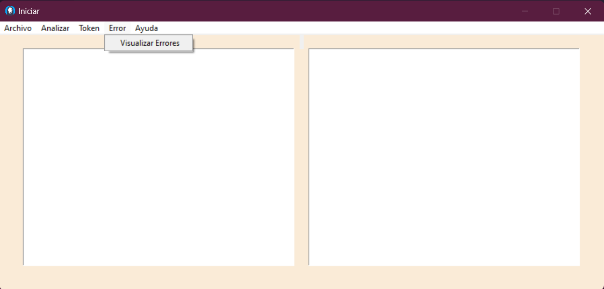
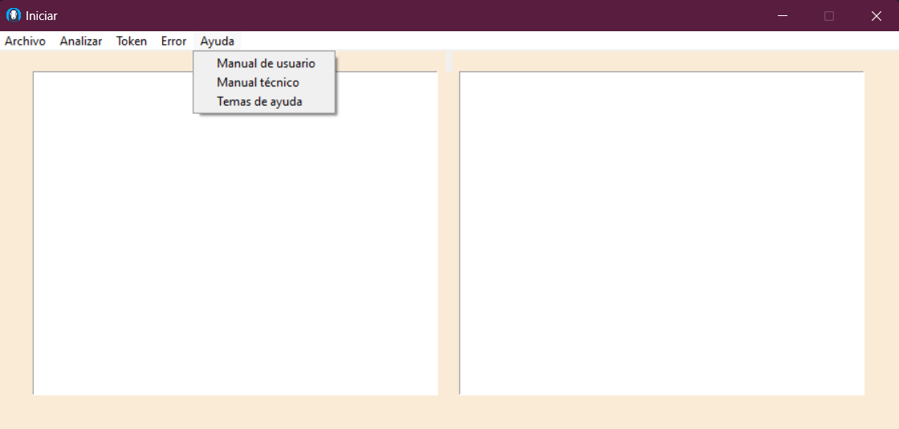

# MANUAL DE USUARIO

## INFORMACIÓN DEL SISTEMA
*Este programa fue creado principalmente pensando en el desarrollo de una aplicación GUI la cual sea capaz de reconocer un lenguaje, dado por medio de un analizador léxico el cual cumple con las reglas establecidas, manejando la lectura y escritura de archivos para el manejo de la información, a través de un entorno gráfico.*

### RECURSOS NECESARIOS
- 2GB de RAM.
- Windows vista o superior.
- Arquitectura de 32 bits o 64 bits.

### OBJETIVOS
- Crear una herramienta que permita el diseño de sentencias de base de datos no relacionales de una forma sencilla para el usuario.
- Diseñar y construir un compilador que permita compilar archivos de entrada y visualizar el resultado en un entorno externo.
- Desarrollar la habilidad del estudiante para elaborar proyectos en base a una adecuada planificación para que aprendan la manera en la que tienen que trabajar.
---
## FUNCIONAMIENTO DEL SISTEMA
*Al iniciar el programa se muestra una ventana principal con dos botones uno inicializa el funcionamiento del programa y el otro termina la ejecución de este.*

1. *Al iniciar el programa se muestra una ventana principal con dos botones uno inicializa el funcionamiento del programa y el otro termina la ejecución de este.*

2. *Al dar click en boton iniciar oculta la ventana principal y muestra una ventana secundaria con dos cuadros de texto y con cinco botones desplegables.*

3. *El boton desplegable Archivo contiene una barra o menu de opciones.*
    - Abrir:
    Permite abrir un archivo ya creado previamente que contiene las sentencias que generar los comandos de MongoDB. Cuando se cargue el archivo se podrá editar en el área de código.
    - Nuevo:
    Limpia el área de edición de código, en la cual el usuario puede editar sus sentencias.
    - Guardar:
    Permite guardar el código que se está escribiendo actualmente.
    - Guardar Como:
    Esta opción permite guardar el código de las sentencias que se está editando con otro nombre.
    - Regresar:
    Permite retornar a la pantalla en la cual se inicializa el programa justo antes de su ejecución.

    

4. *El boton analizar permite generar sentencias mongoDB si el archivo de entrada no contiene errores*

5. *El boton visualizar token abre una nueva ventana en la cual se muestra una tabla con los token del archivo de entrada, la fila y columna en la que se encuentra.*

6. *El boton visualizar error abre una nueva ventana en la cual se muestra una tabla con los errores sintacticos o lexicos encontrados en el archivo de entrada , especificadno ademas la fila y columna en la que se encuentra*

7. *El boton de ayuda contiene tres botones desplegables que redireccionan a los manuales y temas de ayuda que abre una nueva ventana mostrando la información del desarrollador*

---